<!--
TODO: Just some notes about things....


Pre-installation caveats and considerations

* System partitioning, Gparted, etc.
* Device Driver utility - (also how to manually install missing drivers - and where to find them if they are available)
* Network install drivers: `pkgrecv -s http://pkg.openindiana.org/hipster-2015 -d bash.p5a -a bash && sudo pkg install -nv  -g bash.p5a bash`
* Local install drivers: `pkg install -g name.p5a fmri`
* How to disable drivers at boot time (this might help fix the kernel panic we see when trying to boot OI inside KVM)
* Physical or virtual?

What are the post-installation caveats and considerations?

* e.g. - What kinds of things can be done with a system once installed?


Helpful resources for writing some of these sections

* https://web.archive.org/web/20090611234850/http://dlc.sun.com/osol/docs/downloads/minibook/en/820-7102-10-Eng-doc.pdf[ Getting Started with OpenSolaris 2008.11]
* https://web.archive.org/web/20091229232632/http://www.opensolaris.com/learn/[OpenSolaris Learn site - Wayback Machine]
* https://web.archive.org/web/20100105080516/http://dlc.sun.com/osol/docs/content/2009.06/[OpenSolaris 2009.06 docs]
* https://web.archive.org/web/20100401024945/http://www.opensolaris.com/use/OpenSolaris200906Booklet.pdf[OpenSolaris 2009.06 Booklet PDF]

-->


# The OpenIndiana Handbook

< Place Holder for future content >

## Introduction

< Place Holder for future content >


## Introducing OpenIndiana

<!--

The content for this section is pulled from the OpenIndiana FAQ (section 'What is OpenIndiana?').
As the FAQ evolves, try to keep this section in sync.

-->

The OpenIndiana project is the open source community which develops, maintains, and supports the [OpenIndiana](https://en.wikipedia.org/wiki/OpenIndiana) distribution, an [illumos](https://en.wikipedia.org/wiki/Illumos) based Unix-like operating system derived from OpenSolaris.
The purpose of the OpenIndiana Project is to ensure the continued availability of an openly developed distribution based on OpenSolaris.
The OpenIndiana project is also a continuation of the collaborative effort and community spirit of the [OpenSolaris project](https://en.wikipedia.org/wiki/OpenSolaris).

For a comprehensive history of the OpenSolaris project, see Jim Grisanzio's [OpenSolaris timeline](https://jimgrisanzio.wordpress.com/opensolaris/).


## OpenIndiana Software Releases

<!--

The content for this section is pulled from the OpenIndiana FAQ (section 'What is the OpenIndiana Release Schedule?').
As the FAQ evolves, try to keep this section in sync.

-->

Approximately every six months, the OpenIndiana project releases a snapshot of the Hipster rolling release branch.
Ideally suited for both workstations and servers, simply choose the installer type which best serves your needs.


| Workstation | Server
| --- | ---
| Live installer (Gnome desktop) | Text installer (command line console)


**NOTES:**

* OpenIndiana releases from the legacy oi-dev-151x branch are no longer maintained.
* For those desiring to upgrade from legacy installations, Hipster IPS repositories are available.
* While upgrades from the legacy branch are possible, the most trouble free method is to perform a clean install.


**CAUTION:**

Hipster is a rapid development branch where software versions are frequently updated.
While every package is tested to ensure stability, caution is nevertheless warranted when deploying Hipster into mission critical production environments.


## System Requirements

<!--

The content for this section is pulled from the OpenIndiana FAQ (section 'What are the recommended hardware specifications?').
As the FAQ evolves, try to keep this section in sync.

-->

| CPU | Disk Space | Memory (RAM)
| --- | --- | ---
| 64 Bit | 20GB (or more) | 4GB (or more)


## Finding help and support

< Place Holder for section Introduction Content >


### Local system command line help

* apropos - search the manual page names and descriptions
* find - search for files in a directory hierarchy
* info - read Info documents
* locate - find files by name
* man - an interface to the on-line reference manuals


### Web based support resources

<!--

The content for this section is pulled from the OpenIndiana FAQ (section '').
As the FAQ evolves, try to keep this section in sync.

-->


| Resource | URL
| --- | ---
| User Support IRC channel | [#openindiana on irc.freenode.net](irc://irc.freenode.net/openindiana)
| Development IRC channel | [#oi-dev on irc.freenode.net](irc://irc.freenode.net/oi-dev)
| Documentation IRC channel | [#oi-documentation on irc.freenode.net](irc://irc.freenode.net/oi-documentation)
| OpenIndiana Mailing Lists | <http://openindiana.org/mailman>
| OpenIndiana Wiki | <http://wiki.openindiana.org>
| OpenIndiana Bug Tracker | <http://www.illumos.org/projects/openindiana/issues>

## Obtaining the software

<!--

The content for this section is pulled from the OpenIndiana FAQ (section 'Where can I download OpenIndiana Hipster?').
As the FAQ evolves, try to keep this section in sync.

-->

### OpenIndiana Hipster Download Mirrors

* [Primary Mirror](http://dlc.openindiana.org/isos/hipster)
* [Vim.org Alternate Mirror](http://ftp.vim.org/os/openindiana.org/dlc/isos/hipster)
* [Torrents](http://dlc.openindiana.org/torrents/)


If you wish to purchase a ready made DVD or USB drive there is also [OSDISC.COM](https://www.osdisc.com/products/solaris/openindiana).


### USB 3.0 Support

* OpenIndiana Hipster does not yet support USB 3.0 devices.
    * Therefore, at this time it is not possible to install the operating system from a USB 3.0 device.
    * When attaching USB 2.0 devices to your system, please ensure they are *NOT* attached to a USB 3.0 port.


### Creating bootable USB Flash Drives

* Creating a bootable flash drive requires the use of a header file.
* There are 2 unique USB header files (1G and 2G).
* Please ensure you have selected the correct file.
    * The 1G.header is only suitable for use with the text installer (Command line console).
    * The 2G.header is only suitable for use with the live installer (Gnome desktop).
    * The files are *NOT* interchangeable.


### Creating a bootable OpenIndiana DVD

* Obtain the software from the download site
* Check MD5/SHA
* Burn it to a DVD


#### BSD

< Place holder for content >


#### illumos/Solaris

< Place holder for content >


#### Mac OS-X

< Place holder for content >


#### Windows

< Place holder for content >


### Creating a bootable OpenIndiana USB Flash Drive

**IMPORTANT:**

* OpenIndiana Hipster does not yet support USB 3.0 devices.
    * Effectively this means it is not yet possible to install the operating system from a USB 3.0 device
    * When when attaching USB 2.0 devices to your system, please ensure they are *NOT* attached to a USB 3.0 port.

The most reliable method is to use the Windows OpenSolaris USB creation tool.
DD is not always reliable (either doesn't boot at all, or fails to load liveCD and falls back to system maintenance mode with KSH93 errors).

<!--

TODO:

Break this section out into 3 primary parts - One for each type of creation method.

-->


#### Live Media Creation Methods

<!--

TODO:

Add link for Solaris USBCOPY tool.

-->


| Operating System | Method 
| --- | ---
| BSD/Linux/OS X | DD
| illumos/Solaris | usbcopy tool
| Windows | OpenSolaris Live USB Creator


#### BSD/Linux/OS X

< Place Holder for content >

##### Prerequisites

* USB flash drive - (2GB or larger)
* Download the OpenIndiana USB Live Media installer
* Download the appropriate OpenIndiana 1G or 2G header file

**WARNING:**
* There are 2 unique USB header files (1G and 2G).
* When creating a bootable flash drive, please ensure you have selected the correct file.
    * The 1G.header is only suitable for use with the text installer (Command line console).
    * The 2G.header is only suitable for use with the live installer (Gnome desktop).
    * The files are *NOT* interchangeable.

Failure to use the correct USB header file can result in the USB drive either failing to boot, or only partially booting (and falling back to systems maintenance mode with KSH93 errors).

##### Identifying the path to your USB device

| Operating system | Command | Device
| --- | --- | ---
| illumos/Solaris | `rmformat -l` | `/dev/rdsk/c*t*d*`
| Linux | `fdisk -l` | `/dev/sd*`
| FreeBSD | `camcontrol devlist` | `/dev/da*`
| OS X | `diskutil list` | `/dev/disk*`


**WARNING:**

* When issuing the USB copy command, be sure to specify the entire USB device. 
* Do not including any partition or slice number (e.g. use `sda`, not `sda1`; `c0t0d0`, not `c0t0d0p1`).
* Make sure you identify the correct storage device, as all data on the device will be erased.
* Make sure no filesystems located on the device are mounted prior to the next step.
    * Desktops may automatically mount removable devices.
    * As necessary, select any desktop icons for the USB device and issue an 'Eject' or 'Unmount' command.
    * Use the mount command to list mounted filesystems.
    * If any filesystems are located on the USB storage device, they must be unmounted.
    * Use `umount <path>` to unmount a filesystem, or `rmumount <path>` on illumos/Solaris, and `diskutil unmountDisk <path>` on OS X.

##### Copying the Live Media to your Flash Drive

Run the following command (as root or with appropriate privileges):

`cat 1G.header <live USB image file> | dd bs=1024k of=<path to raw USB storage device>`


#### illumos/Solaris

< Place holder for content >

#### Windows

< Place Holder for content >


## Testing Openindiana Using Live Media

The Live Media DVD and USB installers provide a graphical live environment where you can explore OpenIndiana and test the compatibility of your hardware.
When using Live Media to explore OpenIndiana, no changes are made to your system, unless you explicitly choose to install OpenIndiana.

Although it is possible to use it over a network with SSH X forwarding if you enable SSH.

### Booting OpenIndiana

< Place holder for section introduction  content >


#### Booting Physical Hardware

<!--

OpenIndiana can be pretty picky about hardware.
Unsupported components can cause excessive CPU usage.

For example:

* Gigabyte motherboards with Intel socket 775 and ICH10 chipset don't work well with OI.
    * Kernel using from 40-80% cpu @ idle.
* Seems to work OK on Intel brand desktop motherboards though.
* Works well with HP Zxxx class workstation hardware.

-->

Insert the bootable media (DVD or USB flash drive) and boot (start/restart) your computer.
For the computer to boot from the media, you may need to specify the device by pressing the boot order hotkey.
Alternately, you may need to change the boot device order in your BIOS configuration.


#### Booting Virtual Hardware

The most efficient way to boot a virtual machine is to boot directly from the DVD ISO file.
Alternately, you may use host to guest DVD/USB passthrough to boot from physical media.


##### Virtualbox

For VirtualBox 3.2 or later:

"Use host I/O cache" must be enabled in the emulated storage controller used by the virtual machine to successfully boot OpenIndiana.


##### Vmware Workstation Player

< place holder for content >


##### Vmware ESXI

< place holder for content >


### The OpenIndiana Boot Menu

When you see a menu, press Enter to start OpenIndiana on your computer.
As it runs, you will be prompted with a few questions.
You should eventually be presented with a desktop.

### Authenticating when using the OpenIndiana LiveDVD

The user login for the text session is username 'jack' along with the password 'jack'.
For administrative or elevated access, prepend your commands with `pfexec`.
You may also use the `sudo` command.

You may obtain root using the `su` command along with the password 'openindiana'.

### Using the Device Driver Utility

You can use the Device Driver Utility to check if your hardware requires additional drivers.

## Preparing to Install OpenIndiana

<!--

TODO:

- Can OpenIndiana boot on a system with a UEFI BIOS?
- Does secure boot need to be disabled?

-->


< Place Holder for section introduction content >


### Backing up data

< Place holder for content >


### Deciding where to install OpenIndiana

< Place holder for content >


### Gathering Network Information

< Place holder for content >


## Installing OpenIndiana

< Place Holder for content >

<!--

TODO:

For some guidance writing this section:
http://technodrone.blogspot.com/2012/05/openindiana-installation-walkthrough.html

Installation videos:
https://www.youtube.com/watch?v#VVWP_5oAy3w

-->

### Installing OpenIndiana from Live Media

To install OpenIndiana from Live Media, you have two options.

* GUI based guided install.
* Text based guided install.

Each of these options is represented by a desktop icon.
Select the appropriate installer option by clicking the corresponding desktop installer icon.


#### GUI based Guided Install

< Place Holder for Content >


#### Text based Guided Install

The text based guided install start and runs within a command line console.
Navigation within the installer is performed by pressing specifically designated navigation keys (F2, Tab, etc.).

**NOTE:**

The non-graphical text based bootable media installer also uses this very same _Text based Guided Install_.

Start the Text based Guided Install by double clicking the Text based Guided Install icon.

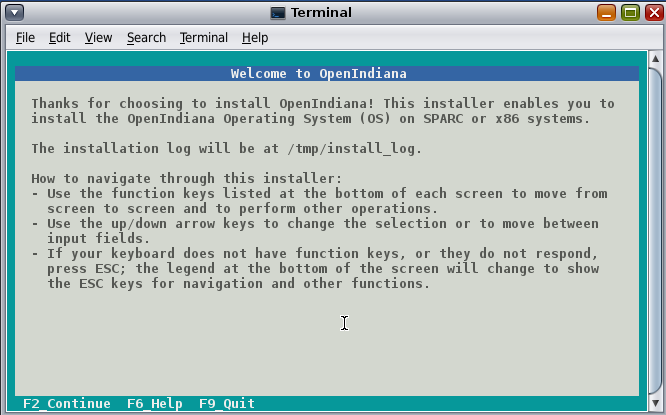

When you begin the Text based Guided Install, you are presented with the welcome screen.
Press F2 to continue.

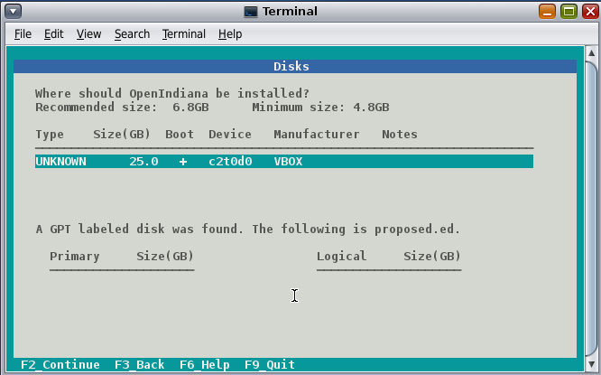

The installer identifies the disks which are available for installation.
If you have only a single disk, it is already selected.
If you have multiple disks, use the arrow keys to select the appropriate disk.
When finished, press F2 to continue.


**NOTE:**

Disregard the minimum and recommended sizes as they do not take into account periodic disk usage growth as the result of ZFS snapshots.
To account for this, your disk should be at least 25GB or more.

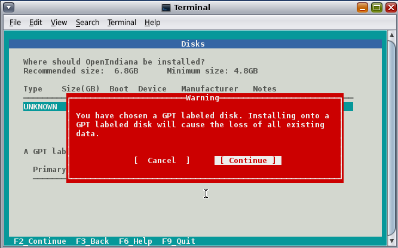

If your disk contains a GPT disk label, the entire disk will be reformatted.
This warning serves as your advisory.
If this is acceptable, press F2 to continue.
Otherwise use the arrow keys to select cancel.

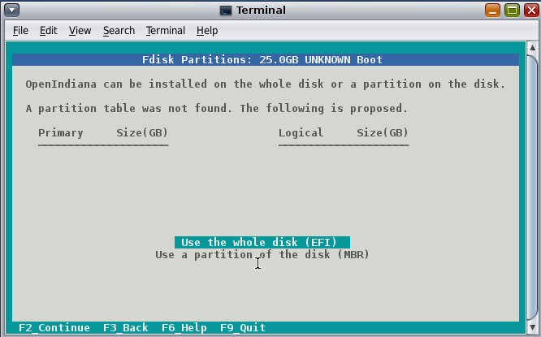

In this screen you are presented with the choice of how to partition the disk.
You may select to use an EFI partition (which uses the entire disk), or you may choose to create MBR partitions.
Using the arrow keys select the appropriate choice and press F2 to continue.


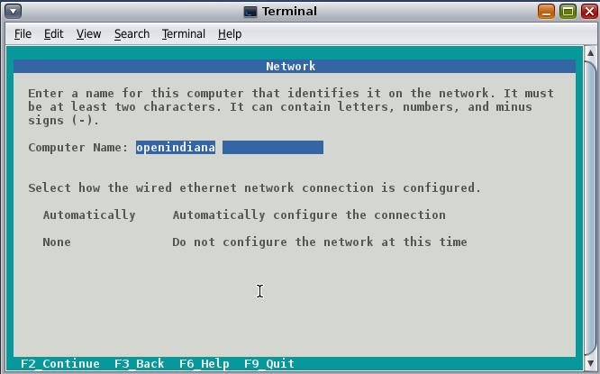

Specify the computer name you wish to use.
By default the computer name is _openindiana_.


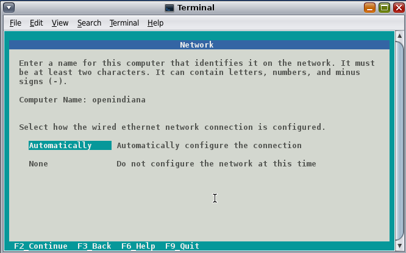

This screen is the same as as the previous.
We have illustrated it twice to help clarify the 2 distinct configuration tasks which need to be completed on the screen.

After configuring the computer name, now you need to decide whether to automatically configure networking (DHCP), or leave network unconfigured.
Use the arrow keys to select your choice.
Press the F2 key to continue.


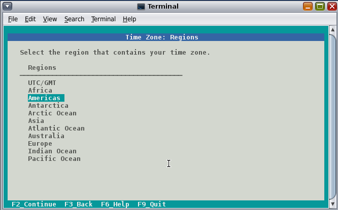

In this screen (and the following 2 screens) you will configure your time zone.
If you select UTC/GMT, you will only be presented with this single screen.
Using the arrow keys select the appropriate region.
Press F2 to continue.


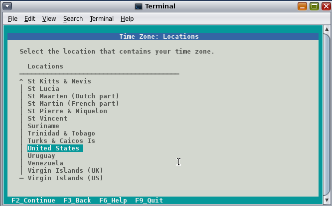

Using the arrow keys, select your time zone location.
Press F2 to continue.

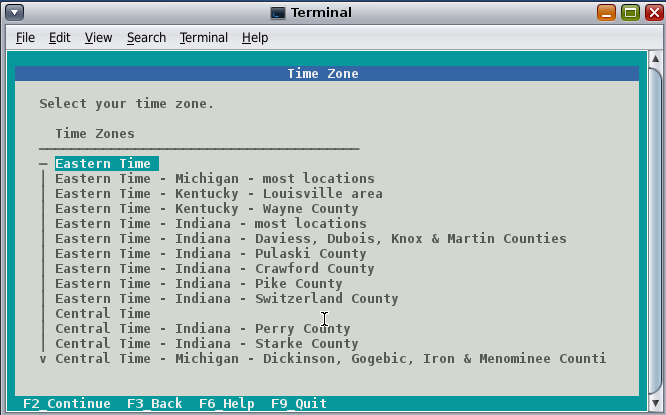

Using the arrow keys, select the appropriate time zone.
Press F2 to continue.

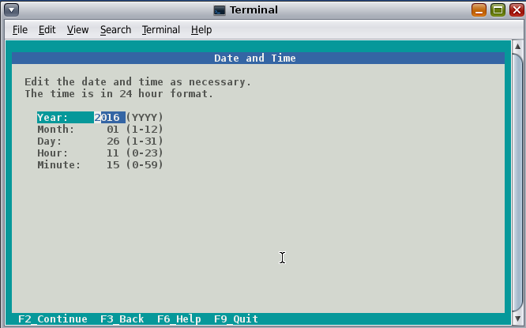

In this screen you may configure the date and time.
Using the arrow keys navigate between the fields.
Press F2 to continue.

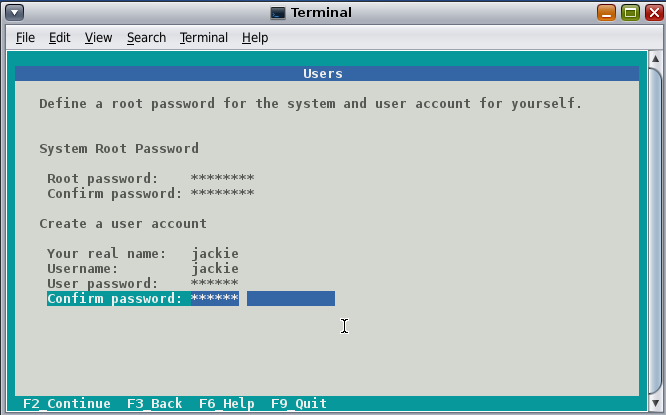

In this screen you are presented with several different fields to configure.
Using the arrow keys navigate between the fields.
Press F2 to continue.

**NOTE:**

The regular user specified on this screen is granted the _root_ role.
In effect this means by default (and without any further configuration) this user can perform administrative task by assuming the root role as needed.
Also, after installation the root password is automatically expired and needs to be changed prior to being used for any administrative task.


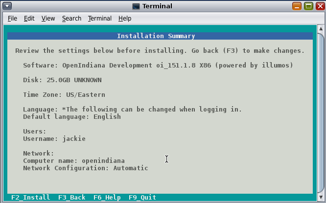

Now that you have completed the installation configuration, you are presented with an _Installation Summary_.
If these configuration settings are correct, begin the installation by pressing the F2 key.

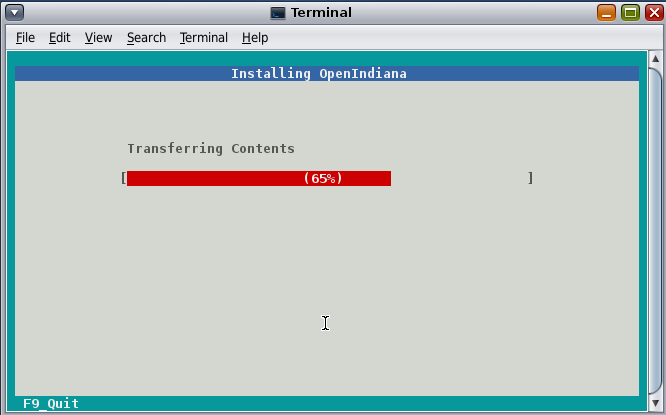

Installation progress is measured by means of a status bar.


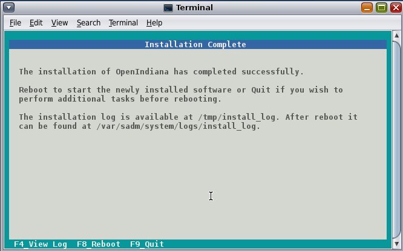

After the installation completes you are presented with a summary screen.
The installation logs are available by pressing the F4 key.
If you ran the installation from Live Media, can exit the installation by pressing F9.
Otherwise, you will want to reboot the system using the F8 key.


### Installing OpenIndiana using the Text Installer

The text installer is not graphical nor does not have a live environment.
When you boot from the text installer, it immediately begins the installation process using the previously described _Text based Guided Install_.


## Troubleshooting Installations

* If you do not see a menu after booting your computer with the DVD or USB device, and instead see some text and a "grub>" prompt, there may be an error in your copy of the installer, or it was created incorrectly.
* If you see a "login:" prompt after selecting your keyboard and language and no desktop appears after several seconds, there may be a problem with the drivers for your graphics hardware.
    * Please let us know via IRC or the mailing list if this happens.
    * When you contact us, please include any error messages you see on the console, as well as the output of the `svcs -xv` command.
    * If possible, also include the contents of the file `/var/log/Xorg.0.log`.

<!--

TODO:

Bring this guidance in alignment with the USB 3.0 warnings found elsewhere in this document.

-->


### USB 3.0 issues

* OpenIndiana Hipster does not currently support USB3.
* You cannot boot a USB thumbdrive installer from a USB3 port.

## Using OpenIndiana

< Place holder for section introduction content >

### Configuring Networking

< Place holder for section introduction content >

#### Command Line

#### Manual Configuration (static IP)

* How to configure a static IP, etc.

#### Automatic Configuration (NWAM)

* How to use NWAM (network auto magic)

#### Desktop GUI

#### Manual Configuration

< Place Holder >

#### Automatic Configuration

< Place Holder >

#### Troubleshooting

* Make sure the network auto magic 'Location' setting is configured as 'Automatic' and not 'NoNet'


### Video Card Support (3D)

Nearly all cards are supported for 2nd, but only Nvidia is supported for 3D.
Work is progressing to provide support for AMD and Intel.

#### Nvidia

* Talk about the expected behavior when booting the live CD from a system with an NVIDIA card.
* Discuss procedure for adding an NVIDIA card to a system that was using VESA or some other non-3d video driver.
* Troubleshooting - what logs to look at, manual configuration, etc.
* Walk through NVIDIA utility screens.

#### AMD

* Currently no 3rd support, VESA driver only.

#### Intel

* Still working to incorporate this into Hipster.

### How does one add a missing device driver?

< Write about finding hardware id's, searching for drivers, installing, loading, /etc/driver_alias'es file. >


### How can the desktop be modified?

* Gnome walkthrough
* Appearance applet
    * Enabling Compiz
    * Configuring font anti-aliasing


### How does one keep the system updated?

Some notes and reference docs for writing the IPS section:

* Be sure to provide walkthroughs for both IPS and BEADMIN (as they work together).
* [Basics of Image Packaging System (IPS) - Oracle](http://www.oracle.com/technetwork/articles/servers-storage-admin/o11-083-ips-basics-523756.html)
* [IPS cheat sheet PDF - Oracle](http://www.oracle.com/technetwork/server-storage/solaris11/documentation/ips-one-liners-032011-337775.pdf)


#### Using pkg to list packages currently installed on the system

< Place holder for content >

#### Using pkg to search for packages

< Place holder for content >

#### Using pkg to update the system

* `pkg update -nv` will perform a dry run and list the changes which would have been made to the system.
* `pkg update` will perform a normal update and print a very brief summary.
* `pkg update -v` will perform the update and then print a summary of what was updated.
* `pkg history` will provide basic details for previous uses of the pkg command.

### How does one find and install more software?


Tips for writing this section:

* <https://pkgsrc.joyent.com/>
* <https://pkgsrc.joyent.com/install-on-illumos/>

* Clean up and consolidate information from website and wiki about where to find additional software.
* Need to answer the questions - Where and how can I install more software?
* Discuss the various package managers (PKGIN, IPS (PKG), etc.)
* Discuss the various repos (opencsw, sfe, pkgsrc.joyent, etc.), what's available in them, and which might break compatibility, etc.
* What is SFE? How does it differ from other repos?
* Add a page for popular available software with descriptions, etc.
* When they say IPS is network centric, they're not kidding;
Packages cannot be installed locally like RPM, instead you have to setup a local network repository.
    * See: <http://serverfault.com/questions/348139/how-to-manually-download-individual-files-from-the-openindiana-or-solaris-pkg>
* How to additional repos, etc.
* How to compile your own software.
I think there is an existing wiki page for this.
Given the limited number of IPS packages currently available, this is a pretty important subject to write about.
    * Also could look here (might be outdated): <http://www.inetdaemon.com/tutorials/computers/software/operating_systems/unix/Solaris/compiling_software.shtml>
* How to install flash player

#### Using the pkg publisher and pkg set-publisher commands

The `pkg publisher` command is used to add and remove remote repositories.

* `pkg publisher` - lists all the repositories configured on the system.
* To add a repository, use `pkg set-publisher -O <Repository_URL> <Repository_Name>`


#### Using the pkgrepo command

The `pkgrepo` command is primarily used for creating and working with IPS repositories.
It can also be used for querying the contents of a repository.

* `pkgrepo info -s <repo_URL>`
* `pkgrepo list -s <repo_URL> <package_group>`

### Configuring a UPS

* NUT?


### How does one perform system backups?

* Time Machine
* ZFS exports
* Bacula?


### How does one add additional users?

* Basic system administration
* Basic Unix commands


### Working with storage and file systems


< Place holder for section introduction content >

#### How does one mount or import additional disks?

<!--

TODO:

* Talk about the ZFS import command.
* Need a walkthrough of mounting options for other filesystems...NTFS, FAT, UFS, etc.

-->

#### commands used

* `mount`

#### NTFS support - 3rd party

* http://jp-andre.pagesperso-orange.fr/openindiana-ntfs-3g.html


#### How does one mirror their root zpool?

* Adding a 2nd disk to the root pool

#### How does one create additional zpools?

* zpool create command
    * Mirrors
    * Raidz

#### Modifying zpool settings and attributes

* zpool get/set commands

#### Modifying zfs file system settings and attributes

* zfs get/set commands

#### How does one create additional zfs datasets?

* zfs create command

#### Configuring system swap

* zfs set command
* swap -l


### Using OpenIndiana as a NAS

< place holder for section introduction content >


#### Configuring OpenIndiana as a CIFS (Samba) Server

##### Home NAS setup steps

* Get the hardware
* Assemble the hardware
* Install OpenIndiana
* Configure OpenIndiana
* Configure Windows

##### commands used

* `sharemgr` - configure and manage file sharing
* `smbadm` - configure and manage CIFS local groups and users, and manage domain membership
*  `zfs` - configures ZFS file systems
* `passwd` - change login password and password attributes
* `chown` - change file ownership


For a variation of configuring a home NAS - this could be done virtually as well

* Running OI as a VMware EXSI guest
    * Local storage hardware is passed through to the OI guest and then shared via ISCSI, CIFS, NFS, etc.

For help writing this section, see the following OpenSolaris references:

* [Setting Up an OpenSolaris NAS Box](https://web.archive.org/web/20091008234550/http://developers.sun.com/openstorage/articles/opensolaris_nas.html)
* [Getting Started With the Solaris CIFS Service](https://web.archive.org/web/20091005070838/http://wiki.genunix.org/wiki/index.php/Getting_Started_With_the_Solaris_CIFS_Service)
* [How to enable guest access to a Solaris CIFS share](https://web.archive.org/web/20091021005616/http://blogs.sun.com/afshinsa/entry/how_to_enable_guest_access)
* [Solaris CIFS Service Troubleshooting](https://web.archive.org/web/20091126111451/http://wiki.genunix.org/wiki/index.php/Solaris_CIFS_Service_Troubleshooting)
* [What's New With Solaris CIFS](https://web.archive.org/web/20091124124935/http://wiki.genunix.org/wiki/index.php/What's_New_With_Solaris_CIFS)
* [CIFS Technical References](https://web.archive.org/web/20090725231658/http://wiki.genunix.org/wiki/index.php/CIFS_Technical_References)

Also have a look at the [OpenSolaris CIFS Administration Guide](https://docs.oracle.com/cd/E19120-01/open.solaris/820-2429/820-2429.pdf)


Start by listing available storage pools.

```bash
# zfs list

NAME                           USED  AVAIL  REFER  MOUNTPOINT
storage                        498K   899G    19K  /storage
```
Create your ZFS dataset to be shared via CIFS/SMB.

```bash
# zfs create -o casesensitivity=mixed -o sharesmb=on storage/backup
```
Start the CIFS service.

```bash
# svcadm enable -r smb/server
```

Join the CIFS server to a workgroup.

```bash
# smbadm join -w WORKGROUP
```

Configure PAM authentication for the CIFS service.

```bash
# echo "other password required pam_smb_passwd.so.1 nowarn" >> /etc/pam.conf
```

Reset the password for the local user accounts which will be used for remotely accessing the CIFS/SMB share.

```bash
# passwd <user_account>
```

Set the share name to be used for the CIFS/SMB share.

```bash
# zfs set sharesmb=name=backup storage/backup
```

Change the ownership of ZFS dataset to the user account which will be used for remotely accessing the CIFS/SMB share.

```bash
# chown -R <user_account> /storage/backup
```

Verify everything is all set to go.

```bash
# sharemgr show -vp

default nfs=()
smb smb=()
        * /var/smb/cvol  smb=() ""
                  c$=/var/smb/cvol       smb=(abe="false" guestok="false")      "Default Share"
zfs smb=()
    zfs/storage/backup smb=()
          backup=/storage/backup
```

You can create additional CIFS datasets using the following 4 commands.

```bash
# zfs create -o casesensitivity=mixed -o sharesmb=on <pool_name/dataset_name>
# zfs set sharesmb=name=<new_share_name> <pool_name/dataset_name>
# chown -R <user_account> <path_to_dataset>
# sharemgr show -vp

```

##### ConfiguringF CIFS/SMB linux client connectivity


Adding a remote share using the linux smbclient

* http://www.tldp.org/HOWTO/SMB-HOWTO-8.html[Accessing an SMB Share With Linux Machines]

Adding a remote share using the KDE Dolphin file manager GUI

* In the left hand pane click _Network_
* In the right hand pane click _Add Network Folder_
* The Network Folder Wizard opens
* Select the radio button for _Microsoft Windows network drive_ and click next
* Specify a name for the share - can be anything - this is just a label
* Specify the remote CIFS/SMB server name (or IP address)
* Specify the share name of the remote CIFS/SMB share
* Click the save and connect button
* You'll be prompted for a remote username and password
* Ensure the checkbox is marked to save credentials or you'll be asked for everything you do.

Adding a remote share using a Windows client

* < place_holder >


#### Configuring OpenIndiana as an NFS Server

< Place holder for content >


#### Configuring OpenIndiana as an ISCSI Target Server -(COMSTAR)

< Place holder for content >


### Getting OI to play Multimedia

* How to get OI to play a DVD
* How to get flash player installed and working.
* How to get VLC installed and working.
* Codecs, etc.
* How to use the hidden `gstreamer-properties` configuration utility.


### Using OpenIndiana as a Media server, HTPC, etc.

* <http://forum.kodi.tv/showthread.php?tid=44315&page=2>
* <http://lightsandshapes.com/plex-on-smartos.html>


### Graphics workstation

< Place holder for content >


### Desktop Publishing system, Etc.

< Place holder for content >


### Virtualization Storage Server

* Poor man's standalone ISCSI SAN linked to a 2nd machine running VMware ESXI (2 computers required)
    * A variation of this would be to run OI as an ESXI guest with local storage hardware "passed through" to OI and then subsequently share ZFS volumes via  ISCSI with the ESXI host itself. In this configuration, OI effectively becomes a SAN (1 computer required)


### Virtualization Server

* Qemu-KVM walkthrough (Does hipster even have this package?)
    * Yes, KVM is the package name
* Using VIRSH, Virt-manager, etc. (Does hipster [or any illumos distro for that matter] even have virsh or Virt-manager)
    * If not, what tools are used to manage the Joyant KVM port (VMADM perhaps?)
    * Virtualbox walkthrough - ditto...is there a package available?

* illumos KVM port does not support AMD processors.
* Intel processors require EPT support.

In a nutshell, most modern Intel processors such as i3, i5, i7, and Xeon support EPT. 
Most older processors such as Core2duo and Core2Quad lack EPT support, and a few of them lack virtualization support at all.

You can check your processor for EPT support via the following link: <http://ark.intel.com/Products/VirtualizationTechnology>

* Hipster is currently testing a new package for managing KVM instances as SMF services.

```
<leoric> Testers needed! pkg://userland/system/qemu/kvmadm@0.10.3,5.11-2015.0.2.0:20160322T212709Z
<leoric> jeffpc: I know, you like kvm :)
<jeffpc> heh
<jeffpc> leoric: is there documentation for it?
<leoric> https://github.com/hadfl/kvmadm/blob/master/doc/kvmadm.pod
<jeffpc> oh, is it http://www.kvmadm.org/ ?
<leoric> yes
<jeffpc> interesting
<jeffpc> I'll have to give it a try at some point
```

### Zones - running web stuff in zone, development, etc.

* Need to mention some of the changes to zone management...e.g..
    * sys-unconfig gone.
    * sysding replaced syscfg
        * now have to have DNS, root password, etc. all configured inside the zone before being able to logon using `zlogin -C <zonename>`, otherwise have to do `zlogin <zonename>`. So a fair amount of stuff has changed there.


### Clustering with Open HA Cluster

See old sun docs

* <http://docs.oracle.com/cd/E19735-01/>

Also see:

* <http://zfs-create.blogspot.nl/>


## Developing with OpenIndiana

[NOTE]
The book titled "Introduction to Operating Systems: A Hands-On Approach Using the OpenSolaris Project" may be a good resource for helping to complete this part of the handbook.


### How can OI be used as a development platform?

< Place holder for content >


### What programming tools, languages, etc., are available?

< Place holder for content > 


### How can OI be used to further the development of OI itself?

< Place holder for content >


## Software Development Testing

< Place Holder >

<!--

TODO:

Need to add some guidance about how to add a test repo to test specific packages, etc.

-->
